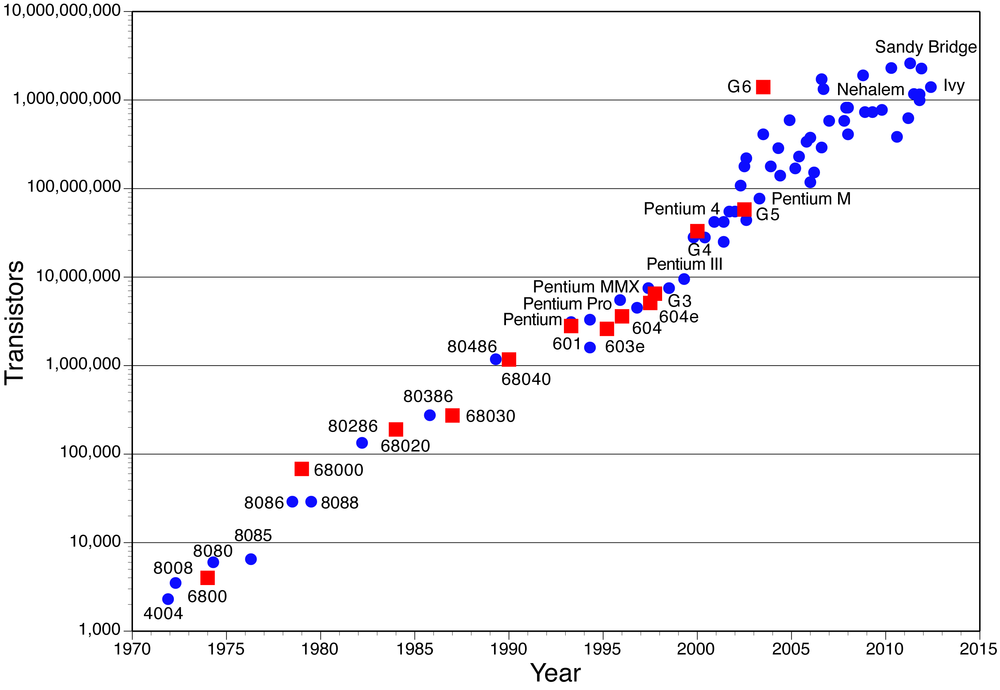
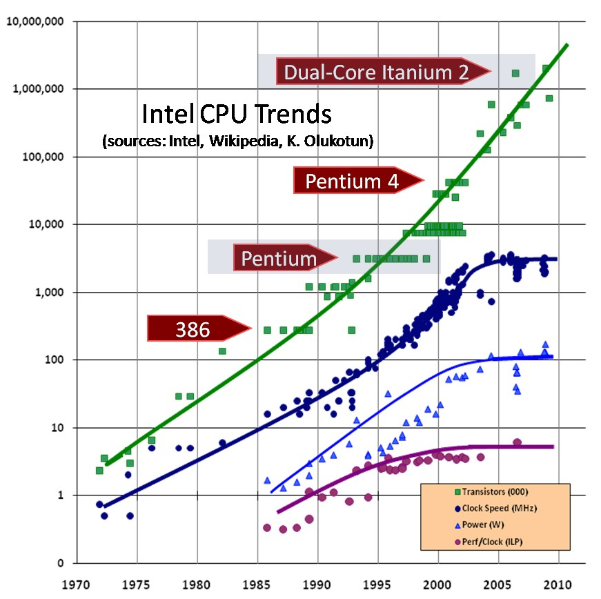
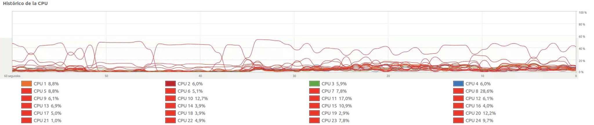
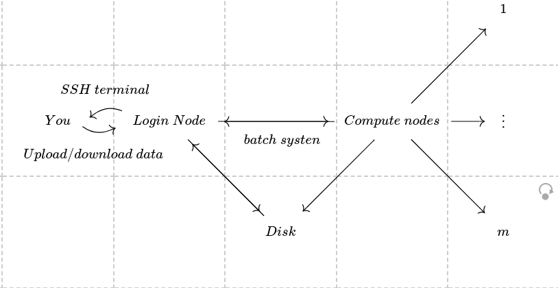
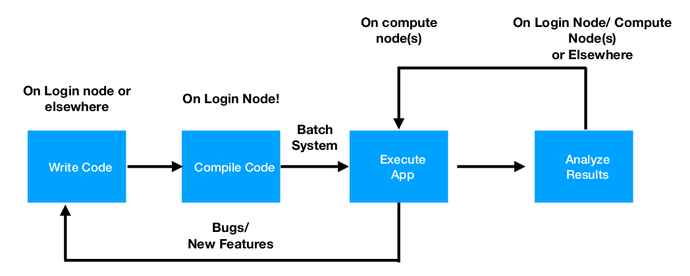

# Scientific Computing II
Julián Jiménez-Cárdenas

---
# Instructor
Julián Jiménez-Cárdenas
Profesor Asistente
*juliano.jimenezc@konradlorenz.edu.co*

- Research Interests:
	- Dynamical Systems
	- Economics
	- Geometry

**Let us talk about your interests!**

---

# Syllabus
## Topics
- You will learn how to **design** and **implement** a parallel programming model to solve scientific problems.
- You are expected to **identify** different parallel programming models, as well as some open-source tools to **solve** applied problems in an efficient manner.

**1. Parallel Programming Software:**
-	C/C++, Python, OpenMP, MPI, Cython.

**2. Tools for Scientists:**
- Numexpr, Theano, Numba, Threading, Multiprocessing...

---

## About the class
1. **Weekly assigments**, given at the end of each session, posted on the Aula Virtual.
	- These assigments are **due the next week**, and are expected to be submitted **prior to the next class**.
2. Quizzes (Conceptual or Numerical), found on the Aula Virtual.
3. Midterms.
4. Final Project.
5. You are expected to have access to a **unix-like** environment with **g/g++ compiler**, **pip/anaconda**, **make** and **git**.

---

## Course Outline
<div class="columns">
<div>

### Module I (Introduction)
- Review of programming languages.
- Analysis of performance.
- Optimization of sequential codes.
- Performance in Python.
	- Numexpr, Theano, Numba.
- Testing.
- Debugging.
- Parallel Architectures.
	- Shared/Distributed Memory.
	- Scalability.

</div>
<div>

### Module II (Parallel Programming)
- Parallel Programming in Python I.
	- Threading.
	- Multiprocessing.
- Parallel Programming using OpenMP.
- Parallel Programming using MPI.
- Parallel Programming in Python II.
	- Mpi4py.
</div>
</div>

---


### Module III (Applications, subject to change)
- C/C++ usage with Python.
	- ctypes.
	- cython.
- Fourier Methods.
- Algebraic Operations.
- Solution of Linear Systems.

---

# Algorithms


Taken from *https://www.geeksforgeeks.org/fundamentals-of-algorithms/*

---

# Algorithms
<style scoped>section { font-size: 25px; }</style>
<div class="columns">
<div>

## Sequential
- It only does one operation at a time.
- More common by historical reasons:
	- Human brain works sequentially.
	- First computers had a single core (processing unit).
- There is no need to share memory.
</div>
<div>

## Parallel
- Can do multiple operations at a time.
- Became relevant recently (2000s), because
	- Multi-core processing units became more popular, and
	- frequency scaling dramatically slowed down due to physical limits.
- There is generally a need of sharing memory (**communication**).
</div>
</div>

---

## (Traditional) Parallel Algorithm Architecture


Taken from *https://www.tutorialspoint.com/parallel_algorithm/parallel_algorithm_models.htm*

---

## Example
Calculate the square of the first $n$ natural numbers.

<div class="columns">
<div>

### Sequential
```python
def square_from_to(start, end):
	for ii in range(start, end):
		print(ii ** 2)

if __name__ == "__main__":
	square_from_to(0, n)
```
$O(n)$
Time spent: 0.048161 s.
</div>
<div>

### Parallel ($m$ processing units)
```python
def control_unit(n, m):
	pool = mp.Pool(processes = m)
	intervals = [(ii, ii + int(n / m)) \
		for ii in range(0, n, int(n / m))]
	output = pool.map(square_from_to, intervals)

if __name__ == "__main__":
	control_unit(n, m)
```
$O(n/m)$
Time spent: 0.012770 s.
</div>
</div>

For $n=100000$ and $m=10$.

The full code can be found [here](https://github.com/julianjica/ScientificComputingII/blob/master/scripts/example_parallel.py).

---

<style scoped>section { font-size: 20px; }</style>

# Motivation

## Moore's Law


<div class="columns">
<div>


Taken from https://education.scinet.utoronto.ca/mod/resource/view.php?id=2329
</div>
<div>
"The number of transistors that can be placed inexpensively on an integrated circuit doubles approximately every two years"


Nevertheless,
- This does not imply an increasing clock speed, because power density is the limiting factor.
- It is reaching its physical limits.
- The continuation of Moore's law is due to the presence of multiple cores, which require **parallel programming**.
</div>
</div>

---

## Moore's Law
<center></center>
Taken from https://education.scinet.utoronto.ca/mod/resource/view.php?id=2329

---

## Applications
### Cellular Automata
<center></center>

---

### Machine Learning
<center></center>

---

### Physics' Simulations
<center></center>

---

### Other Applications
- Big Data Processing.
	- Modern experiments and observations yield vastly more data to be processed than in the past.
	- There is a huge influx of data.
- Graph Rendering.
	- Realistic graphics requires more and more polygons to be displayed.
	- An increase of the FPS increases the computing time of a video.
- Web Servers.
	- The high-demand of clients may require plenty of cores to process petitions.
- Cryptography.
	- RSA algorithm relies on finding the prime divisors of a number.
- and much more...

---

# HPC (High Performance Computing)
- Scientific simulation and modeling drive the **need** for greater computer power.
- Single-core processors **can not** be made to have enough resource for the simulations (calculations) that are currently needed.
	- Making processors with faster clock speeds is difficult due to cost and power/heat limitations.
- **Solution: Parallel Computing** - divide the work among numerous linked systems.

---

## Generic Parallel Machine
<div class="columns">
<div>

<center></center>
</div>
<div>

- Each computer is called a compute **node**.
- Each node has $m$ processor-**cores**.
- These devices are either connected
	- Physically or
	- Through an intranet.
</div>
</div>

---

### About our Workstation

<style scoped>li { font-size: 20px; }</style>
During our course, you **may** work on it.
<div class="columns">
<div>

<center></center>
</div>
<div>

- **12** Procesadores físicos de 2.20GHz (Intel Xeon Processor E5-2650 v4, 2.9GHz Turbo, 2400MHz, 30MB, 105W).
- **32 GB** de RAM (8x4GB, 2400MHz DDR4).
- **2TB** de disco duro SATA 7.2k RPM.
<center></center>
</div>
</div>

---

### What do we mean by performance?
- For scientific and technical programming we use FLOPS
	- Floating Point OPerations per Second.
- Modern Supercomputers' performance is measured in PFLOPS (PetaFLOPS)
	- Giga, Tera, **Peta**, exa = $10^9, 10^{12},10^{15},10^{18}.$

---

### Differences from Desktop Computing
- We do not log on to compute nodes directly.
	- The jobs are submitted via a batch scheduling system.
- (Generally) Not a GUI-based environment.
- You usually share the system with many users.
- The resources are tightly monitored and controlled.
	- Disk quotas.
	- CPU usage.
	- Idle time.
<center></center>

---

### Typical System Layout
<center></center>

The diagram can be found [here](https://tikzcd.yichuanshen.de/#N4Igdg9gJgpgziAXAbVABwnAlgFyxMJZABgBoBGAXVJADcBDAGwFcYkQBNCZkAX1PSZc+QinIVqdJq3YAZCAHMsYADoqABADlobfoOx4CRAMwSaDFm0QgAwhAC2aZjhhr1kWAj0gMBkUQAWMylLdjVaKAgcLwEfIUNRZCDiSQsZa3I+WN9hIxQggCZU6SsQeyz9XMSC0iLzEvYAESw4AGs+SRgoBXgiUAAzACcHJDIQHAgkcRAAIxgwKCQAWmMxxno5xgAFeP9rQawFAAscEHrQ6wBVNEYIeigAekiAdzBb+7coehx6CpAhkaIaYTUY0OYLZarc7pEAAZVhAAk3C5BvZlEwziB1psdn48iADsdTt4AeUgTQQYgaljlKU4BBGFhFjQjjB7kgwMxGIwKfQsIx2JAwLpYqSkNTKdM0qUZt8AMZHdRuOAATzgLkIJOGZIlk0QAS1gN1SGMhp1FL1AFYzeKLUgAGw28njPWO0Xah12oG8Si8IA)

---

### Typical Software Usage Flow
<center></center>

---

### The 80/20 rule
- Programs typically spend 80% of their time in 20% of the code.
- Programmers typically spend 20% of their effort to get 80% of the total speedup for the application. 
- Do not optimize what is not required.

---

### Metrics of performance
What can be measured?
- A **count** of how often an event occurs.
- The **duration** of some interval.
- The **size** of some parameter.

<div class="columns">
<div>

Execution time:
- Wall-clock time.
- CPU time.
</div>
<div>

How are performance measurements triggered?
- Sampling.
- Code instrumentation.
</div>
</div>

*Note:* Execution time is non-deterministic.

---

### Typical performance analysis procedure
**Do** I have a performance problem at all?
- Time / speedup / scalability measurements / how near to limits.

**What** is the key bottleneck (computation / communication)?
- MPI / OpenMP / flat profiling.

**Where** is the key bottleneck?
- Call-path profiling, detailed basic block profiling.

**Why** is it there?
- Hardware counter analysis, trace selected parts to keep trace size manageable.

Does the problem has **scalability problems**?
- Load imbalance analysis, compare profiles at various sizes function-by-function.
