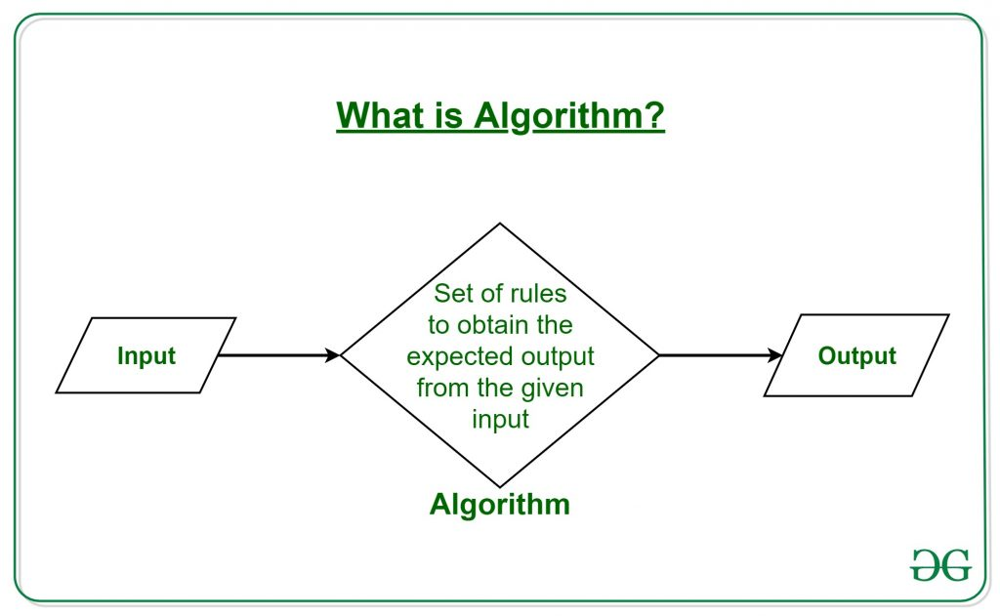
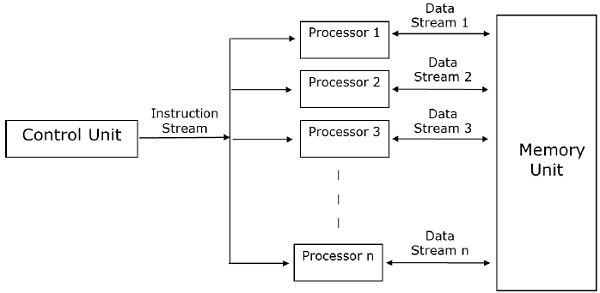

# Scientific Computing II
Julián Jiménez-Cárdenas


---
# Instructor
Julián Jiménez-Cárdenas
Profesor Asistente
*juliano.jimenezc@konradlorenz.edu.co*

- Research Interests:
	- Dynamical Systems
	- Economics
	- Geometry

**Let us talk about your interests!**

---

# Syllabus
## Topics
- You will learn how to **design** and **implement** a parallel programming model to solve scientific problems.
- You are expected to **identify** different parallel programming models, as well as some open-source tools to **solve** applied problems in an efficient manner.

**1. Parallel Programming Software:**
-	C/C++, Python, OpenMP, MPI, Cython.

**2. Tools for Scientists:**
- Numexpr, Theano, Numba, Threading, Multiprocessing...

---

## About the class
1. **Weekly assigments**, given at the end of each session, posted on the Aula Virtual.
	- These assigments are **due the next week**, and are expected to be submitted **prior to the next class**.
2. Quizzes (Conceptual or Numerical), found on the Aula Virtual.
3. Midterms.
4. Final Project.
5. You are expected to have access to a **unix-like** environment with **g/g++ compiler**, **pip/anaconda**, **make** and **git**.

---

## Course Outline
<div class="columns">
<div>

### Module I (Introduction)
- Review of programming languages.
- Analysis of performance.
- Optimization of sequential codes.
- Performance in Python.
	- Numexpr, Theano, Numba.
- Testing.
- Debugging.
- Parallel Architectures.
	- Shared/Distributed Memory.
	- Scalability.

</div>
<div>

### Module II (Parallel Programming)
- Parallel Programming in Python I.
	- Threading.
	- Multiprocessing.
- Parallel Programming using OpenMP.
- Parallel Programming using MPI.
- Parallel Programming in Python II.
	- Mpi4py.
</div>
</div>

---


### Module III (Applications, subject to change)
- C/C++ usage with Python.
	- ctypes.
	- cython.
- Fourier Methods.
- Algebraic Operations.
- Solution of Linear Systems.

---

# Algorithms



Taken from *https://www.geeksforgeeks.org/fundamentals-of-algorithms/*

---

# Algorithms
<style scoped>section { font-size: 25px; }</style>
<div class="columns">
<div>

## Sequential
- It only does one operation at a time.
- More common by historical reasons:
	- Human brain works sequentially.
	- First computers had a single core (processing unit).
- There is no need to share memory.
</div>
<div>

## Parallel
- Can do multiple operations at a time.
- Became relevant recently (2000s), because
	- Multi-core processing units became more popular, and
	- frequency scaling dramatically slowed down due to physical limits.
- There is generally a need of sharing memory (**communication**).
</div>
</div>

---

## (Traditional) Parallel Algorithm Architecture


Taken from *https://www.tutorialspoint.com/parallel_algorithm/parallel_algorithm_models.htm*

---

## Example
Calculate the square of the first $n$ natural numbers.

<div class="columns">
<div>

### Sequential
```python
def square_from_to(start = 0, end):
	for ii in range(start, end):
		print(ii ** 2)

if __name__ == "__main__":
	square_from_to(0, n)
```
Time spent: 0.048161 s.
</div>
<div>

### Parallel ($m$ processing units)
```python
def control_unit(n, m):
	pool = mp.Pool(processes = m)
	intervals = [(ii, ii + int(n / m)) \
		for ii in range(0, n, int(n / m))]
	output = pool.map(square_from_to, intervals)

if __name__ == "__main__":
	control_unit(n, m)
```
Time spent: 0.012770 s.
</div>
</div>

For $n=100000$ and $m=10$.
