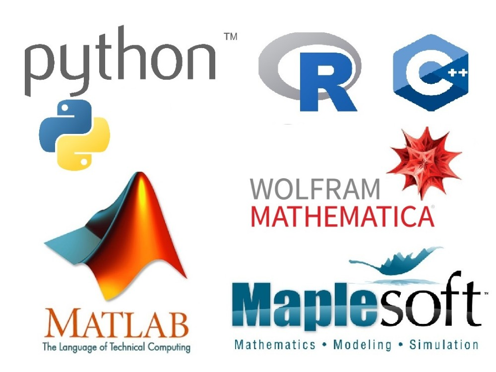

# Programming Languages
## Julián Jiménez-Cárdenas
### Konrad Lorenz University

---
## Languages

<center>
 
</center>


- **Symbolic** and **numeric** computing environments.
- Multi-paradigm programming languages.

---

<center>

</center>

---

<style scoped>li { font-size: 25px; }</style>
## Types of Languages
<div class="columns">
<div>

### Compiled
- The code you write must be compiled, i.e., turned into machine code.
- Syntax errors will prevent the code from being compiled.
- Slower to develop with (must compile, link, run).
- Programs are (relatively) faster.
- Syntax is (tipically) not very clean.
- Good for low-level programming when you need fine control of memory or direct access to hardware.
</div>
<div>

### Interpreted
- The code you write is run by an interpreter, line by line.
- Syntax errors are found when the interpreter hits that line.
- The text file is the program.
- Much faster to write and experiment in.
- Slower than compiled languages, but modern techniques and computers have vastly narrowed this gap.
</div>
</div>

---

## Which one should you use?
- Computers are fast today.
	- There is no need to worry about memory allocation.
- Code readability and reuse tends to be more important than running time for almost all contexts.
- If things go out of control, you should
	- Use profiling for time-critical or CPU intensive code.
	- You can find the bottleneck using the current tools, avoid guessing.

---

<style scoped>li { font-size: 25px; }</style>
### You need

- A computer.
	- Best if is Unix-like.
- Anaconda/pip.
- C/C++ compilers.
- A good text editor.
	- Pick one that is easy to use and can help you.
	- Probably we'll use VSC for profiling, but you are free to use another.
	- If you like terminal editors like **emacs/(neo)vim**, there are plenty of extensions in the IDE-based ones that emulate their behavior.
	- should have
		- Syntax highlighting.
		- Line numbers.
		- Can execute code directly from the editor.
		- Aware of functions.
---

# C++ Reminder

---

## Basic C++ Program
<style scoped>li { font-size: 25px; }</style>
<div class="columns">
<div>

```cpp
// hello_world.cpp
// This program prints "Hello World"
#include <stdio.h> //including files
#include <string>
int main(int argc, char *argv[]) //main function
{
	// braces delimit a code block
	std::string message = "Hello World!";
	printf("%s",message.c_str()); // casting
	return 0;
	// return value to shell
}
```
We compile it
```bash
$g++ -std=c++11 -o hello_world hello_world.cpp
```
and execute it
```bash
$./hello_world
```
</div>
<div>

- We can include other C++ files using the **#include** directive.
- Each executable statement or declaration ends with a **semicolon**.
- **Curly braces** denote a code block.
- When declaring a variable of certain **type**, the type is specified before the variable or function name.
- The value to be given back by a function is specified by the **return** statement, which exits the function.
- Comments can be added using the double slashes //.
</div>
</div>

---

<style scoped>li { font-size: 25px; }</style>
## Variables
<div class="columns">
<div>

```cpp
int a = 3;
int b = -4;
int c = a + b;

double d = 4.5;
float e;
e += c;

char* str = "String Pointer.";
bool val = true;

int lista[3] = {1, 2, 3};
bool vals[4];
vals = {true, true, false, false};
```
</div>
<div>

**type name [=value]**
- Floating point type.
	- float, double, long double std::complex <float, complex>
- Integer type.
	- [unsigned] short, int, long, long long
- Character or string of characters:
	- char, char*, std::string
- Boolean
	- bool
- Array, pointer, class, structure, enumerated type, union, etc.
</div>
</div>

---

## Functions
```cpp
// functions.cpp
// Including Math Functions
#include <math.h>
#include <stdio.h>
// declaration
double exponentiation(double a, double b);

// main function, called when the program starts
int main(void){
	double x = 4;
	double y = 0.5;
	double result = exponentiation(x, y);
	printf("%f", result);
	return 0;
}

// function definition
double exponentiation(double a, double b){
	return pow(a,b);
}
```

---

## Loops
<div class="columns">
<div>

### for
```cpp
#include <stdio.h>
int main(){
	// initialization ; condition; increment
	for (int ii = 0; ii <= 10; ii++){
		// statements
		printf("%i", ii * ii);
	}
}
```
</div>
<div>

### while
```cpp
#include <stdio.h>
int main(){
	int ii = 0;
	// condition
	while (ii <= 10);
		// statement
		printf("%i", ii * ii);
		ii ++;
}
```
</div>
</div>

- Both loops can be stopped using **break**.

---

## Conditionals

```cpp
#include <iostream>
int main(){
	int ii;
	std::cin >> ii;
	if (ii > 0)
		std::cout << ii << " is greater than zero.";
	else if (ii < 0)
		std::cout << ii << " is smaller than zero.";
	else
		std::cout << ii << " is zero.";
}
```

---

## Hands on!
Consider the Fibonacci sequence $a_0=a_1=1$, $a_{n+2} = a_{n+1} + a_{n}$. Assume that $\lim_{n\to\infty} a_{n+1}/a_{n} = \phi.$
- Estimate $\phi$ with a relative error of at most $10^{-6}$, where

$relative\ error (n) = \left|\frac{a_{n+1}}{a_n}-\frac{a_{n}}{a_{n-1}}\right|$
- For which value of $n$ do we get this estimation?

Mathematical (driven) questions.
- What is the exact value of $\phi$? 
- What happens to the limit if we take arbitrary $a_0, a_1\in\mathbb{N}$?

---

## Let's go to Python
